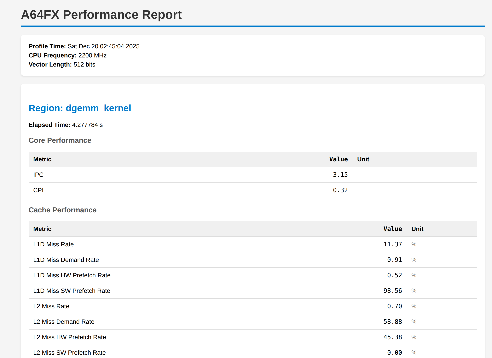

# preport - A64FX Performance Report Tool

A command-line tool for analyzing Fujitsu A64FX processor performance profiles generated by the FAPP profiler. It processes PMU (Performance Monitoring Unit) counter data and provides comprehensive performance metrics with bottleneck analysis.



## Features

- **Comprehensive PMU Event Support**: Supports 120+ A64FX PMU events
- **A64FX PMU Errata Corrections**: Applies official corrections for L2 cache miss counting
- **Multiple Output Formats**: ASCII (terminal), HTML (styled report), JSON (programmatic access)
- **Bottleneck Analysis**: Automatic detection of performance issues with optimization suggestions
- **SVE Vectorization Metrics**: Detailed SVE/SIMD utilization analysis

## Requirements

- Node.js (v14 or later)
- FAPP profiler output files (pa1.csv - pa17.csv)

## Installation

```bash
cd preport
# No installation required, run directly with Node.js
```

## Usage

```bash
node preport.js [options]
```

### Options

| Option | Description |
|--------|-------------|
| `-n, --files <num>` | Number of pa*.csv files to read (1-17, default: 17) |
| `-r, --region <name>` | Region to report (can be used multiple times) |
| `--html` | Output HTML format |
| `--json` | Output JSON format |
| `-o, --output <file>` | Output file (default: stdout) |
| `-h, --help` | Show help message |

### Examples

```bash
# ASCII output to terminal (all regions, all counter files)
node preport.js

# Read only first 5 counter files
node preport.js -n 5

# Report specific region only
node preport.js -r dgemm_kernel

# Generate HTML report
node preport.js --html -o report.html

# Generate JSON for programmatic access
node preport.js --json -o report.json

# Combine options
node preport.js -n 17 -r dgemm_kernel --json -o kernel_report.json
```

## Input Files

The tool expects FAPP profiler CSV output files in the current directory:
- `pa1.csv` through `pa17.csv` - Each file contains different sets of PMU counters

These files are generated by running the FAPP profiler with the `-Icpupa` option.

### PMU Events per File

Each pa*.csv file contains a specific set of PMU (Performance Monitoring Unit) events:

#### pa1.csv - FP Operations & L2 Cache
| Hex | Name | Description |
|-----|------|-------------|
| `0x80c0` | FP_SCALE_OPS_SPEC | SVE FP operations (scaled) |
| `0x80c1` | FP_FIXED_OPS_SPEC | SIMD FP operations (fixed) |
| `0x0017` | L2D_CACHE_REFILL | L2 cache refill |
| `0x0018` | L2D_CACHE_WB | L2 cache write-back |
| `0x0325` | L2D_SWAP_DM | L2 swap (demand hits prefetch buffer) |
| `0x0326` | L2D_CACHE_MIBMCH_PRF | L2 prefetch hits demand buffer |
| `0x0121` | EFFECTIVE_INST_SPEC | Effective instructions (excl. MOVPRFX) |
| `0x8000` | SIMD_INST_RETIRED | SIMD instructions retired |

#### pa2.csv - Commit & Stall Cycles
| Hex | Name | Description |
|-----|------|-------------|
| `0x0190` | 0INST_COMMIT | Cycles with 0 instructions committed |
| `0x0191` | 1INST_COMMIT | Cycles with 1 instruction committed |
| `0x0184` | LD_COMP_WAIT | Cycles waiting for cache/memory |
| `0x0186` | LD_COMP_WAIT_PFP_BUSY | Cycles waiting for prefetch port |
| `0x0189` | EU_COMP_WAIT | Cycles waiting for int/FP instruction |
| `0x018c` | ROB_EMPTY | Cycles with empty CSE |
| `0x018d` | ROB_EMPTY_STQ_BUSY | Cycles with empty CSE and full SP |
| `0x018e` | WFE_WFI_CYCLE | Cycles halted by WFE/WFI |

#### pa3.csv - Pipeline Utilization
| Hex | Name | Description |
|-----|------|-------------|
| `0x0240` | L1_PIPE0_VAL | L1D pipeline#0 valid cycles |
| `0x0241` | L1_PIPE1_VAL | L1D pipeline#1 valid cycles |
| `0x0330` | L2_PIPE_VAL | L2 pipeline valid cycles |
| `0x0274` | L1_PIPE_ABORT_STLD_INTLK | L1D pipe abort (store-load interlock) |
| `0x01a4` | FLA_VAL | FLA pipeline valid cycles |
| `0x01b4` | FLA_VAL_PRD_CNT | FLA pipeline predicate count |
| `0x01a5` | FLB_VAL | FLB pipeline valid cycles |
| `0x01b5` | FLB_VAL_PRD_CNT | FLB pipeline predicate count |

#### pa4.csv - L1/L2 Cache & Gather/Scatter
| Hex | Name | Description |
|-----|------|-------------|
| `0x0325` | L2D_SWAP_DM | L2 swap (demand hits prefetch buffer) |
| `0x0003` | L1D_CACHE_REFILL | L1D cache refill |
| `0x0049` | L1D_CACHE_REFILL_PRF | L1D cache refill by prefetch |
| `0x0017` | L2D_CACHE_REFILL | L2 cache refill |
| `0x0300` | L2D_CACHE_REFILL_DM | L2 cache refill (demand) |
| `0x80ad` | SVE_LD_GATHER_SPEC | SVE gather load operations |
| `0x80ae` | SVE_ST_SCATTER_SPEC | SVE scatter store operations |
| `0x0326` | L2D_CACHE_MIBMCH_PRF | L2 prefetch hits demand buffer |

#### pa5.csv - Load/Store & FP Operations
| Hex | Name | Description |
|-----|------|-------------|
| `0x8010` | FP_SPEC | Floating-point operations |
| `0x8028` | FP_FMA_SPEC | FP fused multiply-add operations |
| `0x8034` | FP_RECPE_SPEC | FP reciprocal estimate operations |
| `0x0070` | LD_SPEC | Load instructions |
| `0x0071` | ST_SPEC | Store instructions |
| `0x8085` | ASE_SVE_LD_SPEC | SIMD/SVE load operations |
| `0x8086` | ASE_SVE_ST_SPEC | SIMD/SVE store operations |
| `0x8087` | PRF_SPEC | Prefetch operations |

#### pa6.csv - Memory Stall Breakdown
| Hex | Name | Description |
|-----|------|-------------|
| `0x0185` | LD_COMP_WAIT_EX | Cycles waiting for cache/memory (int load) |
| `0x0182` | LD_COMP_WAIT_L1_MISS | Cycles waiting for L2 (L1 miss) |
| `0x0183` | LD_COMP_WAIT_L1_MISS_EX | Cycles waiting for L2 (L1 miss, int load) |
| `0x0180` | LD_COMP_WAIT_L2_MISS | Cycles waiting for memory (L2 miss) |
| `0x0181` | LD_COMP_WAIT_L2_MISS_EX | Cycles waiting for memory (L2 miss, int load) |
| `0x0187` | LD_COMP_WAIT_PFP_BUSY_EX | Cycles waiting for prefetch port (int load) |
| `0x0188` | LD_COMP_WAIT_PFP_BUSY_SWPF | Cycles waiting for prefetch port (SW prefetch) |
| `0x018a` | FL_COMP_WAIT | Cycles waiting for FP/SIMD instruction |

#### pa7.csv - Commit Distribution & FP Precision
| Hex | Name | Description |
|-----|------|-------------|
| `0x0192` | 2INST_COMMIT | Cycles with 2 instructions committed |
| `0x0193` | 3INST_COMMIT | Cycles with 3 instructions committed |
| `0x0194` | 4INST_COMMIT | Cycles with 4 instructions committed |
| `0x018b` | BR_COMP_WAIT | Cycles waiting for branch instruction |
| `0x80c6` | FP_DP_SCALE_OPS_SPEC | SVE double-precision FP ops |
| `0x80c4` | FP_SP_SCALE_OPS_SPEC | SVE single-precision FP ops |
| `0x80c7` | FP_DP_FIXED_OPS_SPEC | SIMD double-precision FP ops |
| `0x80c5` | FP_SP_FIXED_OPS_SPEC | SIMD single-precision FP ops |

#### pa8.csv - Energy & Pipeline Execution
| Hex | Name | Description |
|-----|------|-------------|
| `0x01a6` | PRX_VAL | PRX pipeline valid cycles |
| `0x01e0` | EA_CORE | Core energy consumption (8nJ/count) |
| `0x03e0` | EA_L2 | L2 energy consumption (32nJ/count) |
| `0x03e8` | EA_MEMORY | Memory energy consumption (256nJ/count) |
| `0x01a0` | EAGA_VAL | EAGA pipeline valid cycles |
| `0x01a1` | EAGB_VAL | EAGB pipeline valid cycles |
| `0x01a2` | EXA_VAL | EXA pipeline valid cycles |
| `0x01a3` | EXB_VAL | EXB pipeline valid cycles |

#### pa9.csv - Cache Prefetch & TLB
| Hex | Name | Description |
|-----|------|-------------|
| `0x0049` | L1D_CACHE_REFILL_PRF | L1D cache refill by prefetch |
| `0x0202` | L1D_CACHE_REFILL_HWPRF | L1D cache refill (HW prefetch) |
| `0x0059` | L2D_CACHE_REFILL_PRF | L2D cache refill by prefetch |
| `0x0302` | L2D_CACHE_REFILL_HWPRF | L2 cache refill (HW prefetch) |
| `0x0005` | L1D_TLB_REFILL | L1D TLB refill |
| `0x002d` | L2D_TLB_REFILL | L2D TLB refill |
| `0x0001` | L1I_CACHE_REFILL | L1I cache refill |
| `0x0326` | L2D_CACHE_MIBMCH_PRF | L2 prefetch hits demand buffer |

#### pa10.csv - SVE Operations & Branch
| Hex | Name | Description |
|-----|------|-------------|
| `0x8091` | SVE_LDR_REG_SPEC | SVE LDR operations |
| `0x8092` | SVE_STR_REG_SPEC | SVE STR operations |
| `0x80bc` | SVE_LDFF_SPEC | SVE first-fault load operations |
| `0x80af` | SVE_PRF_GATHER_SPEC | SVE gather prefetch operations |
| `0x809f` | SVE_PRF_CONTIG_SPEC | SVE contiguous prefetch operations |
| `0x009f` | DCZVA_SPEC | DC ZVA instructions |
| `0x8043` | ASE_SVE_INT_SPEC | SIMD/SVE integer operations |
| `0x0012` | BR_PRED | Branch predictions |

#### pa11.csv - FP/SVE Load/Store Details
| Hex | Name | Description |
|-----|------|-------------|
| `0x80a5` | ASE_SVE_LD_MULTI_SPEC | SIMD/SVE multi-vector load |
| `0x80a6` | ASE_SVE_ST_MULTI_SPEC | SIMD/SVE multi-vector store |
| `0x8038` | FP_CVT_SPEC | FP convert operations |
| `0x0105` | FP_MV_SPEC | FP move operations |
| `0x0113` | FP_ST_SPEC | FP store operations |
| `0x0108` | PRD_SPEC | Predicate register operations |
| `0x0112` | FP_LD_SPEC | FP load operations |
| `0x011a` | BC_LD_SPEC | Broadcast load operations |

#### pa12.csv - Micro-ops & Branch Prediction
| Hex | Name | Description |
|-----|------|-------------|
| `0x8008` | UOP_SPEC | Micro-operations |
| `0x0198` | UOP_ONLY_COMMIT | Cycles with only micro-ops committed |
| `0x0199` | SINGLE_MOVPRFX_COMMIT | Cycles with only MOVPRFX committed |
| `0x0139` | UOP_SPLIT | Micro-operation splits |
| `0x0010` | BR_MIS_PRED | Branch mispredictions |
| `0x0012` | BR_PRED | Branch predictions |

#### pa13.csv - SVE Predicate & Special Ops
| Hex | Name | Description |
|-----|------|-------------|
| `0x8095` | SVE_LDR_PREG_SPEC | SVE LDR predicate operations |
| `0x8096` | SVE_STR_PREG_SPEC | SVE STR predicate operations |
| `0x807c` | SVE_MOVPRFX_SPEC | SVE MOVPRFX operations |
| `0x800e` | SVE_MATH_SPEC | SVE math operations |
| `0x0109` | IEL_SPEC | Inter-element operations |
| `0x010a` | IREG_SPEC | Inter-register operations |
| `0x0077` | CRYPTO_SPEC | Cryptographic instructions |

#### pa14.csv - HW Prefetch Activity
| Hex | Name | Description |
|-----|------|-------------|
| `0x0230` | L1HWPF_STREAM_PF | L1 HW streaming prefetch requests |
| `0x0231` | L1HWPF_INJ_ALLOC_PF | L1 HW prefetch injection (alloc) |
| `0x0232` | L1HWPF_INJ_NOALLOC_PF | L1 HW prefetch injection (non-alloc) |
| `0x0233` | L2HWPF_STREAM_PF | L2 HW streaming prefetch requests |
| `0x0234` | L2HWPF_INJ_ALLOC_PF | L2 HW prefetch injection (alloc) |
| `0x0235` | L2HWPF_INJ_NOALLOC_PF | L2 HW prefetch injection (non-alloc) |
| `0x0236` | L2HWPF_OTHER | L2 HW prefetch (other) |

#### pa15.csv - Gather/Scatter & L1 Pipeline
| Hex | Name | Description |
|-----|------|-------------|
| `0x02b2` | L1_PIPE_COMP_GATHER_0FLOW | Gather 2-element 0-flow |
| `0x02b1` | L1_PIPE_COMP_GATHER_1FLOW | Gather 2-element 1-flow |
| `0x02b0` | L1_PIPE_COMP_GATHER_2FLOW | Gather 2-element 2-flow |
| `0x02b8` | L1_PIPE0_COMP_PRD_CNT | L1D pipe#0 predicate count |
| `0x02b9` | L1_PIPE1_COMP_PRD_CNT | L1D pipe#1 predicate count |
| `0x0260` | L1_PIPE0_COMP | L1D pipeline#0 completed requests |
| `0x0261` | L1_PIPE1_COMP | L1D pipeline#1 completed requests |

#### pa16.csv - L2 Miss & Bus Write
| Hex | Name | Description |
|-----|------|-------------|
| `0x0309` | L2_MISS_COUNT | L2 cache misses |
| `0x0396` | L2D_CACHE_SWAP_LOCAL | L2 swap local |
| `0x0370` | L2_PIPE_COMP_PF_L2MIB_MCH | L2 prefetch hits demand buffer |
| `0x0121` | EFFECTIVE_INST_SPEC | Effective instructions (excl. MOVPRFX) |
| `0x0318` | BUS_WRITE_TOTAL_CMG0 | Bus write to CMG0 |
| `0x0319` | BUS_WRITE_TOTAL_CMG1 | Bus write to CMG1 |
| `0x031a` | BUS_WRITE_TOTAL_CMG2 | Bus write to CMG2 |
| `0x031b` | BUS_WRITE_TOTAL_CMG3 | Bus write to CMG3 |

#### pa17.csv - Bus Read/Write & L2 OC
| Hex | Name | Description |
|-----|------|-------------|
| `0x0316` | BUS_READ_TOTAL_MEM | Bus read from memory |
| `0x0314` | BUS_READ_TOTAL_TOFU | Bus read from Tofu |
| `0x0315` | BUS_READ_TOTAL_PCI | Bus read from PCI |
| `0x031e` | BUS_WRITE_TOTAL_MEM | Bus write to memory |
| `0x031c` | BUS_WRITE_TOTAL_TOFU | Bus write to Tofu |
| `0x031d` | BUS_WRITE_TOTAL_PCI | Bus write to PCI |
| `0x0391` | L2_OC_RD_MIB_HIT | L2 OC read MIB hit |
| `0x03ae` | L2_OC_WR_MIB_HIT | L2 OC write MIB hit |

## Output Formats

### ASCII (Default)

Human-readable text format suitable for terminal viewing:

```
================================================================================
                        A64FX Performance Report
================================================================================
Profile Time   : Sat Dec 20 02:45:04 2025
CPU Frequency  : 2200 MHz
Vector Length  : 512 bits

--------------------------------------------------------------------------------
Region: dgemm_kernel
Elapsed Time: 4.277784 s
--------------------------------------------------------------------------------

Core Performance:
  IPC                       :         3.15
  CPI                       :         0.32

Cache Performance:
  L1D Miss Rate             :        11.37 %
  L2 Miss Rate              :         0.70 %
  ...
```

### HTML

Styled HTML report with tables and color-coded bottleneck analysis. Suitable for sharing and archiving.

### JSON

Structured JSON format for programmatic access:

```json
{
  "info": {
    "profilerVersion": "4.2.5",
    "measuredTime": "Sat Dec 20 02:45:04 2025",
    "cpuFrequency": 2200,
    "vectorLength": 512
  },
  "regions": {
    "dgemm_kernel": {
      "elapsed": 4.277784,
      "metrics": { ... },
      "counters": { ... },
      "bottleneckAnalysis": { ... }
    }
  }
}
```

## Metrics Categories

| Category | Metrics |
|----------|---------|
| **Core Performance** | IPC, CPI |
| **Cache Performance** | L1D/L2 miss rates, miss latency |
| **L1 Load-Store Instructions** | Total, single vector loads, broadcast loads, non-SIMD loads/stores |
| **Floating-Point Performance** | GFLOPS (SVE/SIMD/Total), FP operations count |
| **Memory Bandwidth** | Memory read/write bandwidth (GB/s) |
| **Pipeline Utilization** | Stall rates, FLA/FLB/EXA/EXB/EAGA/EAGB utilization |
| **Busy Rate** | Memory, L1, L2 busy rates |
| **Branch Prediction** | Misprediction rate, branch counts |
| **TLB Performance** | L1D/L2D TLB miss rates |
| **Memory Stall Breakdown** | L1/L2 miss stalls, prefetch port stalls |
| **Commit Distribution** | 0/1/2/3/4-instruction commit rates |
| **FP Precision Breakdown** | SP/DP GFLOPS breakdown |
| **SVE/SIMD Operations** | Loads, stores, gather/scatter, prefetch ops |
| **HW Prefetch** | L1/L2 HW prefetch activity |
| **Bus Traffic** | Memory/CMG/Tofu/PCI bandwidth |
| **Energy** | Core/L2/Memory energy, total power |
| **SVE Predication** | Predicate counts, avg active elements |

## Bottleneck Analysis

The tool automatically detects performance bottlenecks and provides optimization suggestions:

### Detected Issues

| Category | Issues Detected |
|----------|-----------------|
| **Core Performance** | Low IPC, high stall rate |
| **Memory** | High memory stall, L2 miss stall, bandwidth saturation |
| **Cache** | High L1D/L2 miss rates |
| **TLB** | High TLB miss rate |
| **Branch** | High branch misprediction |
| **Compute** | High FP/SIMD stall, low FMA utilization |
| **Vectorization** | Low vector utilization, high gather ratio |
| **Frontend** | High ROB empty rate |

### Severity Levels

- **HIGH**: Critical performance issues requiring immediate attention
- **MEDIUM**: Noticeable performance impact
- **LOW**: Minor optimization opportunities
- **INFO**: Informational (e.g., memory-bound workload characteristics)

### Example Analysis Output

```
--------------------------------------------------------------------------------
BOTTLENECK ANALYSIS
--------------------------------------------------------------------------------

[!] Memory: High memory stall rate (25.3%)
    Significant time spent waiting for memory operations.
    Suggestions:
      - Use software prefetching (PRFM instructions)
      - Improve data locality and cache blocking
      - Consider data layout changes for better cache utilization

[*] Cache: High L1D miss rate (22.5%)
    Many memory accesses miss the L1 data cache.
    Suggestions:
      - Improve spatial locality (sequential access patterns)
      - Use smaller data types if precision allows
      - Consider Structure of Arrays (SoA) layout
```

## A64FX PMU Errata Corrections

The tool applies corrections from the A64FX PMU Events Errata document for accurate L2 cache miss counting:

| Event | Correction |
|-------|------------|
| L2D_CACHE_REFILL | raw - L2D_SWAP_DM - L2D_CACHE_MIBMCH_PRF |
| L2D_CACHE_REFILL_DM | raw - L2D_SWAP_DM |
| L2D_CACHE_REFILL_PRF | raw - L2D_CACHE_MIBMCH_PRF |
| L2_MISS_COUNT | raw - L2D_CACHE_SWAP_LOCAL - L2_PIPE_COMP_PF_L2MIB_MCH |

These corrections account for overcounting that occurs when demand and prefetch requests are temporally close.

## References

- [Fujitsu A64FX GitHub Repository](https://github.com/fujitsu/A64FX) - Official documentation including PMU event specifications and microarchitecture manuals

## License

See [LICENSE](LICENSE) file.
