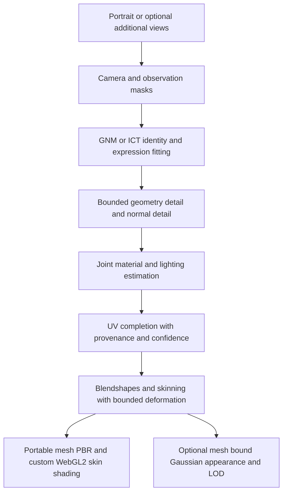

# Portrait to 3D face reconstruction and skin materials

Research snapshot: **2026-09-30**. Audience: vhuman reconstruction, rigging,
material, and browser rendering development.

Implementation roadmap: [Adoption plan for vhuman portrait reconstruction](vhuman-face-reconstruction-adoption-plan.md).

For vhuman, the recommended direction is a fitted, animatable mesh with explicit
skin materials, followed by an optional Gaussian appearance layer. This is an
engineering recommendation based on exportability, control of speech deformation,
and WebGL2 constraints. It is not a measured ranking of reconstruction quality.
Single portraits are the primary input here; additional photographs, head-turn
video, and controlled lighting are quality upgrades.

This survey includes strong research references even when their releases have
noncommercial terms. A code license, a weight license, a face-model license, and
a dataset license are separate records. “Unverified” below means that this
research pass did not establish a usable release or its terms; it does not mean
that the method has no implementation. No external models were run for this
survey. Quality and speed claims in linked papers belong to their authors.

## Current vhuman capabilities

The [head skin baker](../server/vhuman/head/skin.py) writes base color, normal,
ORM, and mask images plus metadata. It preserves portrait color and adds
procedural pores and freckles. Its optional broad illumination correction is an
estimate; it does not establish ground-truth diffuse albedo. Roughness is
artist-controlled, and the outputs do not constitute recovered specular or
tissue-scattering maps.

The [face model adapter](../server/vhuman/rig/face_models.py) already supports
GNM v3, ICT-FaceKit Light, and procedural topology, with expression and skeletal
controls. These are suitable targets for a stronger fitter. The accepted lid,
socket, segmentation, and lighting limitations remain recorded in
[QUALITY_PLAN.md](../server/vhuman/QUALITY_PLAN.md). This document proposes future
work and does not change that acceptance or claim an implemented improvement.

## Face geometry reconstruction

The useful separation is **identity shape**, **expression and pose**, and
**surface detail**. A portrait with a smile must not permanently bake that smile
into the neutral identity. Likewise, apparent wrinkles can arise from geometry,
pigmentation, illumination, or several of these together.

| Method and source | Input and output | Quality contribution and limitation | Release and vhuman relevance |
| --- | --- | --- | --- |
| [DECA, SIGGRAPH 2021](https://github.com/yfeng95/DECA) | One image; FLAME shape, expression, pose, lighting, and detail | Animatable detail and expression-dependent wrinkles. Extracted portrait texture still needs material decomposition. | Official PyTorch code and models; noncommercial scientific research terms. Useful coarse/detail baseline, with separate FLAME and optional albedo dependencies. |
| [EMOCA, CVPR 2022](https://github.com/radekd91/emoca) | One image or video; expressive detailed face | Expression fidelity; v2 improves lip and eye alignment. Identity accuracy and reflectance recovery need separate evaluation. | PyTorch; noncommercial code/model terms. Repository declares deprecation in favor of Inferno, so retain as a historical baseline. |
| [MICA, ECCV 2022](https://github.com/Zielon/MICA) | One image; neutral identity shape and FLAME parameters | Identity initialization in metric space. Scale and hidden shape depend on learned priors; this is not an individual anatomical measurement. | PyTorch; [noncommercial model/software license](https://github.com/Zielon/MICA/blob/master/LICENSE), FLAME and recognition-model dependencies. Geometry reference, not a material estimator. |
| [SMIRK, CVPR 2024](https://github.com/georgeretsi/smirk) | One image or video; expression geometry | Neural analysis-by-synthesis separates geometry supervision from sampled appearance; useful for subtle and asymmetric expressions. | Official PyTorch code is MIT; required FLAME assets and pretrained-model terms need separate review. Study expression losses for our topology. |
| [HRN, CVPR 2023](https://github.com/youngLBW/HRN) | Single or multiple views; hierarchical coarse shape and detail | Coarse-to-fine geometry refinement. Authors warn that exported high-frequency mesh detail can differ from rendered detail. | PyTorch inference, Apache-2.0 root code license; training code not released in the inspected README. Required assets/weights and borrowed components need separate review. |
| [Pixel3DMM, 2025](https://github.com/SimonGiebenhain/pixel3dmm) | Single image, video, or separate photos; parametric fitting constrained by dense screen-space cues | Normals and correspondence priors constrain more of the surface than sparse landmarks. Occluded geometry remains underdetermined. | Official PyTorch implementation, CC-BY-NC 4.0, FLAME dependencies. Strong geometry comparison; investigate independently trained cues on GNM/ICT. |
| [MeshLAM, CVPR 2026](https://meshlam.github.io/) | One image; animatable mesh and UV texture | Joint shape/texture branches, progressive GRU refinement, reprojection guidance. Authors report an 8K-vertex representation; texture detail alone does not establish recovered BRDF. | Project code link leads to LAM. Dedicated MeshLAM inference/checkpoints were not established in this pass. Design reference pending a verified release. |

**Recommended geometry experiments:** compare dense geometric constraints against
our present scaffold fit, then add bounded displacement or detail normals while
preserving topology. Follow with neutralization and expression transfer tests.
This recommendation combines ideas from the comparison; it does not imply that
FLAME-trained checkpoints can be applied directly to GNM or that converting
their outputs changes their terms.

Generic image-to-object reconstruction remains useful for hair, accessories, or
an initial head surface. It needs additional identity, topology, neutralization,
and rig checks before becoming the speech-animation face. A convincing input-view
render alone cannot establish those properties.

## Skin texture and reflectance reconstruction

### Material channels

The purpose of material estimation is to render the same identity under a new
light, view, and expression. Increasing texture resolution cannot resolve a
shadow that has been baked into base color.

| Quantity | Role | Reconstruction and export consideration |
| --- | --- | --- |
| Diffuse albedo | Surface/body color after illumination separation | Preserve pigmentation and freckles; identify shadows, highlights, makeup, and hair separately. Predicted albedo is still an estimate. |
| Specular reflectance | Strength/color of surface reflection | Distinguish specular strength from roughness and from lighting intensity. Record the renderer's parameterization and IOR assumptions. |
| Roughness or glossiness | Width and shape of highlights | “Glossy” is not a unique physical map. Convert only with a documented BRDF convention; arbitrary inverse grayscale is insufficient. |
| Normals and displacement | Meso/micro detail and surface geometry | Separate diffuse and specular normal detail where supported. Detail normals do not modify silhouette; displacement must remain compatible with deformation. |
| SSS profile and thickness | Light transport beneath the surface | Profile distances require units. Thickness supports transmission estimates but does not determine scattering coefficients. |
| Hemoglobin and melanin | Skin absorption-related parameters | Learned maps are material priors, not clinical or measured tissue properties. Their interpretation depends on the skin model used for rendering. |
| Dynamic wrinkles | Detail varying with expression | Keep neutral detail and expression corrections separate; test compression and stretching during jaw, lip, and brow motion. |

The parameter mapping must be explicit. glTF's
[KHR_materials_specular](https://github.com/KhronosGroup/glTF/tree/main/extensions/2.0/Khronos/KHR_materials_specular)
extends the metallic-roughness BRDF and specifies its texture/color conventions.
It does not accept an arbitrary research “specular albedo” map unchanged.
[KHR_materials_volume](https://github.com/KhronosGroup/glTF/tree/main/extensions/2.0/Khronos/KHR_materials_volume)
defines thickness and absorption but explicitly excludes scattering transport.
Consequently it does not provide complete skin SSS interoperability.

### Methods to compare

| Method and source | Input and material output | Useful technique and quality limitation | Availability and terms |
| --- | --- | --- | --- |
| [NextFace](https://github.com/abdallahdib/NextFace) | One or multiple images; mesh, diffuse/specular/roughness UV maps, lighting | Staged joint geometry/material/light optimization followed by per-texel refinement. Shared identity across photos adds constraints. Lighting can still leak into reflectance. | Official PyTorch implementation; [GPL-3.0 code](https://github.com/abdallahdib/NextFace/blob/master/LICENSE). BFM and AlbedoMM assets have separate terms. Use as an external comparison, not copied MIT code. |
| [AvatarMe++](https://arxiv.org/abs/2112.05957) | One image; high-resolution shape and reflectance | Captured reflectance priors and rendering-aware training; includes self-occlusion and a scattering approximation. Detail inferred from a low-resolution portrait is prior-driven. | [Author repository](https://github.com/lattas/AvatarMe) provides project/dataset information. Complete inference release, checkpoints, and commercial-use terms were not established here. |
| [FitMe, CVPR 2023](https://arxiv.org/abs/2305.09641) | One or multiple images; mesh and relightable texture assets | Fit a multimodal reflectance generator and PCA shape through differentiable rendering. Latent expressivity aids completion but can introduce inferred identity details. | [Author project](https://alexlattas.com/fitme); reproducible code/checkpoint bundle and its terms remain unverified in this pass. |
| [Relightify, ICCV 2023](https://foivospar.github.io/Relightify/) | One image fitted/unwrapped to partial UV; diffuse/specular albedo and normals | Joint diffusion completion of visible texture, missing regions, and reflectance. Unseen details are plausible completions rather than observations. | Inspected project provides paper/video; inference code, weights, and their terms were not established. |
| [ID2Reflectance, CVPR 2024](https://github.com/xingyuren/id2reflectance) | Aligned portrait; image-space reflectance, with multi-view stitching in the paper | RGB/reflectance codebooks and identity-conditioned reflectance synthesis. Evaluate identity retention and stitching consistency. | PyTorch multi-domain model implementation is released. Full asset pipeline/checkpoint coverage and commercial terms remain unresolved; BasicSR, CodeFormer, and SimSwap dependencies also need review. |
| [S³-Face, CVPR 2025](https://xingyuren.github.io/s3face/) | In-the-wild images; diffuse/specular/normal plus hemoglobin/melanin maps | Two-stage diffusion prior: reflectance first, pigment maps second. These support its SSS formulation; they do not measure an individual's tissue. | Inspected project labels code “coming soon.” Code/checkpoint/data terms remain unverified. Important SSS research reference. |
| [Monocular Facial Appearance Capture in the Wild, ICCV 2025](https://openaccess.thecvf.com/content/ICCV2025/papers/Xu_Monocular_Facial_Appearance_Capture_in_the_Wild_ICCV_2025_paper.pdf) | Head-turn video; geometry, diffuse, specular intensity, roughness | Joint capture with visibility/occlusion modeling under unknown illumination. Additional views improve constraints over one portrait. | Primary paper available; usable implementation, weights, and data terms were not established here. Video upgrade reference. |

**Recommended material approach:** implement staged inverse rendering on our own
mesh with identifiable, bounded material parameters, then evaluate a learned
completion prior trained on appropriately licensed reflectance or synthetic data.
Compare fitted materials under withheld lights and views before adding generated
pores. Keep completion confidence and observation coverage in the evaluation
record; a sharp synthetic pore pattern should not mask incorrect broad geometry
or albedo.

For WebGL2, investigate diffuse scattering separately from surface specular
reflection. [Separable Subsurface Scattering](https://www.iryoku.com/separable-sss/)
is a useful two-pass screen-space reference. Its public code is an older version,
not the full updated 2015 implementation; the
[repository notice](https://github.com/iryoku/separable-sss) uses permissive
conditions that require preserving attribution. Proposed own implementation:
depth/normal-aware diffusion of the diffuse contribution, bounded profile radii,
and a separate thin-region transmission approximation. Screen-space scattering
has visibility and boundary limitations, so compare it with an offline skin
transport reference. Rendering SSS also differs from simulating soft-tissue
deformation; the material maps do not establish elastic parameters.

## Gaussian head reconstruction and animation

Ordinary Gaussian appearance reconstruction and relightable skin capture solve
different problems. View-dependent radiance can reproduce highlights without
recovering the light, roughness, or scattering responsible for them. Explicit
material or learned transport models add requirements to the representation and
training. A splat file must be inspected for its actual attributes before claiming
material export or relighting support. The relighting distinction is demonstrated
by the specialized shading/capture in
[BecomingLit](https://jonathsch.github.io/becominglit/) and the learned radiance
transfer in [URAvatar](https://junxuan-li.github.io/urgca-website/index.html).

| Method and source | Capture and representation | Animation and relighting | Release and browser implications |
| --- | --- | --- | --- |
| [GaussianAvatars, CVPR 2024](https://github.com/ShenhanQian/GaussianAvatars) | Recorded multi-view sequences; Gaussians bound to FLAME triangles | Local triangle coordinates support rig-driven expression transfer. Appearance reconstruction alone does not establish intrinsic material recovery. | Official Python/PyTorch code; CC-BY-NC-SA 4.0 plus dependency terms. Study binding; its Python viewer is not a rendering-performance benchmark. |
| [LAM, SIGGRAPH 2025](https://github.com/aigc3d/LAM) | One portrait; feed-forward animatable Gaussian head | Canonical representation with skeletal/expression deformation; released speech and browser ecosystem. Material relighting needs separate evidence. | Apache-2.0 core code; [CC-BY-NC 4.0 weights](https://github.com/aigc3d/LAM/blob/master/LICENSE_WEIGHT), FLAME/third-party terms. [WebGL renderer](https://github.com/aigc3d/LAM_WebRender) is released with an MIT root license; audit package dependencies and example assets independently. |
| [OMG-Avatar, CVPR 2026](https://arxiv.org/abs/2603.01506) | One image; Gaussian head with multiple levels of detail | Coarse-to-fine representation and local image conditioning address fidelity and rendering cost. Multi-LOD is especially relevant to mobile. | Paper available. A runnable code/checkpoint release and its terms were not verified; retain as a design reference. |
| [BecomingLit, NeurIPS 2025](https://github.com/jonathsch/becominglit) | Multi-view light-stage sequences; intrinsically decomposed Gaussians | Parametric head and expression dynamics; neural diffuse shading plus analytic specular shading enables relighting. | Official PyTorch training/evaluation code; [CC-BY-NC 4.0](https://github.com/jonathsch/becominglit/blob/main/LICENSE), FLAME and dataset requirements. Its training/render stack is not a WebGL2 drop-in. |
| [URAvatar, SIGGRAPH Asia 2024](https://junxuan-li.github.io/urgca-website/index.html) | Phone scan personalized against a prior trained on multi-view, multi-light captures | Learned radiance transfer includes global transport; animation, gaze, and relighting. It needs a substantial captured training prior. | Paper/project available. Public implementation/checkpoints and usable terms were not established here. High-quality transport reference, not a verified deployment dependency. |

**Proposed Gaussian experiment:** bind an optional appearance layer to the same
deformed mesh used by the existing facial rig. Preserve local orientation and
scale during deformation, and validate covariance as well as center positions.
Test jaw opening, blinking, cheek compression, and lip contact for floating
splats or holes. Mesh-bound appearance is an engineering hypothesis for our rig;
the surveyed implementations use different models and are not interchangeable.

For mobile WebGL2, evaluate splat density/LOD, alpha overdraw, depth ordering,
attribute bandwidth, sorting cost, and supported precision. CUDA renderer timings
cannot predict browser performance. Mesh/splat compositing must also handle
depth, eye occlusion, mouth interiors, and transparent hair consistently. Converting
Gaussians to a mesh or baking their appearance does not by itself disentangle
lighting or produce valid roughness and SSS maps.

## Recommended vhuman development path

The following is a proposed sequence, not an implemented backend or a guarantee
that a particular checkpoint is commercially usable.

1. **Geometry first:** evaluate dense normals/correspondences, silhouette masks,
   camera fitting, and neutral identity separation. Compare Pixel3DMM, SMIRK,
   and HRN as permitted external references. Train any production cue predictor
   on our chosen topology and licensed data; preserve fitting diagnostics.
2. **Materials second:** independently implement joint diffuse/specular/roughness
   and illumination fitting. Use NextFace's published optimization approach as
   a comparison, with GPL code kept outside the MIT implementation. Study
   diffusion completion through Relightify and S³-Face; do not make unreleased
   checkpoints a required pipeline dependency.
3. **Portable runtime:** keep blendshapes, skinning, and bounded local deformation
   as the shared controls. Bake meso/micro detail into maps, retain appropriate
   geometry for silhouette, and evaluate a custom scattering shader against an
   offline reference. Map research materials to glTF conventions explicitly.
4. **Optional appearance upgrade:** evaluate LAM externally where its terms allow,
   then prototype independently implemented mesh binding and Gaussian LOD using
   permitted assets. Compare against the mesh/PBR output under identical motion,
   view, and lighting conditions.

This is the commercially oriented direction recommended by this survey:
repository-authored algorithms on separately permitted topology, training data,
and outputs. No end-to-end commercial reconstruction checkpoint has been cleared
by this document. Reusing a method's idea, using its software, training from its
outputs, and redistributing its assets are distinct provenance questions.

### Capture upgrades for higher quality

| Input upgrade | Expected benefit, as an engineering inference | Remaining ambiguity |
| --- | --- | --- |
| Additional sharp, neutral views | More silhouette, ear, nose, and cheek constraints; better UV coverage | Unknown camera/lighting and inconsistent expressions still confound fitting. |
| Head-turn video with stable exposure | Shared identity and temporally linked views; useful highlights and visibility changes | Motion blur, lighting changes, and expression drift need modeling. |
| Controlled light changes and polarization | Stronger separation of surface reflection and diffuse/body transport | Calibration, transport model, capture consistency, and subject motion remain important. |

## Evaluation before selecting a backend

Use consented portraits spanning skin tones, East Asian and other face shapes,
age, facial hair, makeup, glasses, expression, and lighting. Keep any benchmark's
license and permitted uses with its manifest. Public clips and capture datasets
remain URL references with manual download instructions; do not add media or
weights to Git.

| Question | Proposed validation |
| --- | --- |
| Is identity geometry correct? | With scans where available, report aligned surface error and region-specific errors; declare scale/alignment choices. With photos alone, report held-out silhouettes/landmarks and uncertainty, not claimed scan accuracy. |
| Are materials relightable? | Withhold views and illumination; inspect shadow leakage, highlight shape, specular strength, and pigmentation consistency. Match exposure and color processing. |
| Are invented details controlled? | Compare observed and completed UV regions separately; evaluate multiple completion seeds and identity consistency. Keep generated pores out of geometry-accuracy claims. |
| Does the rig preserve the result? | Test neutral, smile, jaw opening, blinks, lip closure, brow motion, and speech; inspect contacts, folds, UV seams, normals, and Gaussian attachment over time. |
| Does SSS improve skin rendering? | Compare fixed material profiles with an offline reference under grazing light, backlight, and thin-region transmission. Inspect boundary bleeding and energy balance. |
| Is it viable on mobile? | Record actual device/browser, resolution, mesh/splat counts, texture memory, download size, sorting/deformation/render time, p50/p95 frame time, and sustained thermal behavior. |

Input-view PSNR or an identity embedding alone is insufficient for selection.
Keep geometry, novel-view appearance, relighting, expression fidelity, and runtime
cost as separate results. Author-reported timings use different inputs, hardware,
and inclusion of preprocessing; this survey intentionally makes no shared speed
leaderboard. The next validation step is an isolated comparison on permitted
inputs, with exact revisions and configurations recorded alongside local outputs.
