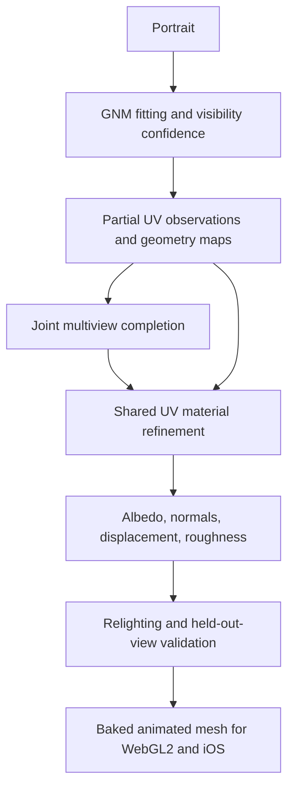

# Research: multiview and 3D-aware face material completion

Research date: 2026-10-06. Status: proposed architecture, not an implemented
photorealistic reconstruction pipeline. Model availability, memory figures and
licenses below were checked against the linked primary sources on this date.
Published GPU requirements are not measurements on our AMD hardware.

## Recommendation

Keep GNM as the identity and expression surface. Replace independent whole-view
editing and generic wrinkle-color transfer with geometry-conditioned multiview
generation, followed by refinement of one shared UV material representation.
Predict albedo, normals/displacement and roughness separately, with anatomical
conditioning and relighting validation. Bake the result for the existing
WebGL2/iOS mesh runtime; diffusion remains an offline preprocessing step.

Use MV-Adapter as the first quality baseline if its base-model terms are
acceptable. For a strictly permissive dependency route, investigate
Qwen-Image-Edit-2509 with explicit surface consistency and a face-specific UV
material model trained on cleared data. Neither route is a verified local
solution yet. The principal long-term gap is facial material training data,
especially measured detail and reflectance, rather than another prompt.

## Why the current result is inadequate

`reconstruction.multiview_skin` renders calibrated views but edits them
independently. A contact sheet is not joint multiview attention or an enforced
3D correspondence. In the Obama experiments, edits stayed flat; stronger
whole-view generation invented another ear.

`reconstruction.wrinkle_skin` avoids that failure by editing a skin-only patch
and projecting luminance residuals through a shared triplanar material field.
It preserves mesh geometry and observed texels, but introduces repeated color
patterns without anatomical conditioning. It does not infer wrinkle depth,
normal maps or subject-specific hidden anatomy. The user rejected its visual
quality despite increased contrast.

Historical diagnostics for `wrinkles15`:

| Check | Result | What it establishes |
| --- | --- | --- |
| Material edit | 384 px, 10 steps, CFG 4, strength 1; 471 seconds | An actual Qwen edit ran |
| Left/right baked contrast RMS | 0.00184/0.00195 to 0.01182/0.01190 | More mid-scale image contrast |
| Photographed texels | 175,326 unchanged | Preservation of source RGB |
| Regression suite | 89 tests passed | Tested numerical and pipeline invariants |
| AMD browser preview | Approximately 30 FPS | Desktop runtime performance |

None of these establishes realistic skin, accurate unseen anatomy, wrinkle
depth, or iPhone performance. Retain the implementation as a reproducible
experimental baseline, not the recommended photorealistic completion method.
Local artifacts: `tmp/vhuman-generated-skin/wrinkle-material01`, candidate
`tmp/vhuman-public-portraits/obama/head/reconstruction/wrinkles15`, and browser
checks `tmp/vhuman-browser/wrinkles-check01/verification.json`.

## Methods and model selection

| Method | Relevant capability | Decision and limits |
| --- | --- | --- |
| [MV-Adapter](https://github.com/huanngzh/MV-Adapter) | Reference-image and geometry-conditioned joint multiview generation | First quality baseline. Authors report about 14 GB for image-to-multiview and a lower-memory SD2.1 variant. Full texture generation on ROCm is unverified; the official texture setup includes CV-CUDA. |
| [SyncMVD](https://github.com/LIU-Yuxin/SyncMVD) | Shares denoised content across views during sampling | Adopt its surface-consensus principle. Original implementation is MIT, uses SD/ControlNet and a PyTorch3D rendering stack tested on NVIDIA. |
| [MVPaint](https://arxiv.org/abs/2411.02336) | Synchronized multiview generation, spatial 3D inpainting and seam treatment | Algorithm reference for holes and seams; not selected as an audited deployable dependency. |
| [MV2UV](https://arxiv.org/abs/2603.15436) | Combines multiview priors with geometry-aware UV completion | Strong reference for reconciling conflicting views and unseen surface regions. A usable permissive checkpoint was not verified in this research. |
| [Relightify](https://foivospar.github.io/Relightify/) | Joint UV completion of facial appearance and reflectance, including diffuse/specular albedo and normals | Closest architectural reference for the eventual face-material model. No ready-to-integrate checkpoint was verified from the project page. |
| [FaceLift](https://github.com/weijielyu/FaceLift) | Face-specific multiview diffusion and Gaussian head reconstruction | Research comparison. Apache-2.0 code but Adobe Research License weights; training data are not released. Gaussian appearance is not directly our animated PBR mesh output. |
| [Hunyuan3D-Paint 2.1](https://github.com/Tencent-Hunyuan/Hunyuan3D-2.1) | Mesh-conditioned PBR texture synthesis | Defer: official texture requirement is 21 GB, with custom rendering dependencies and a non-permissive community license. |

Scene-completion techniques contribute visibility reasoning, surface
correspondence, and inpainting. A face additionally needs identity, anatomical
regions, expression correspondence, and skin reflectance. General scene or
object appearance quality alone is insufficient evidence for facial detail.

### Licensing and checkpoint distinctions

- MV-Adapter [weights](https://huggingface.co/huanngzh/mv-adapter) are
  Apache-2.0. Its SDXL base has [OpenRAIL++ terms](https://huggingface.co/stabilityai/stable-diffusion-xl-base-1.0/blob/main/LICENSE.md),
  so the combined stack is not strictly permissive. Code and adapter licenses
  do not replace base-model terms.
- [Qwen-Image-Edit-2509](https://huggingface.co/Qwen/Qwen-Image-Edit-2509) is
  Apache-2.0 and supports multi-image input and geometry-like image conditions.
  It is a different checkpoint from the research-licensed Qwen 2.1 configured
  locally. Multi-image editing does not itself enforce geometric consistency;
  do not relabel existing `qwen-research` assets.
- [Marigold V2 adapters](https://huggingface.co/huawei-bayerlab/marigold-v2-0)
  are Apache-2.0 over Qwen-Image-Edit-2509. Albedo and normal predictions could
  initialize material fitting. The published implementation needs about 17 GB
  at 1024 square pixels and uses CUDA; training used a 32 GB GPU. Its scene
  benchmarks do not establish facial pore or wrinkle accuracy. Reduced
  resolution/offloaded ROCm inference and face-specific quality need testing.
- [Hunyuan3D 2.1's license](https://raw.githubusercontent.com/Tencent-Hunyuan/Hunyuan3D-2.1/main/LICENSE)
  includes territory, use, and model-training restrictions. Do not treat its
  outputs as automatically cleared supervision for our own model.
- Audit code, base weights, adapters, training assets and generated-output terms
  separately. Public availability of a portrait or scan does not establish
  permission to redistribute it or use it for appearance training.

## Proposed pipeline

### 1. Geometry and semantic separation

Fit silhouette, jaw, ear attachment and skull shape alongside landmarks. Permit
bounded residual deformation while preserving GNM rig correspondence. A good
frontal landmark fit does not establish correct side geometry.

Separate skin, hair, eyes and mouth. In the current example the crown needs a
scalp/hair decision; skin wrinkles cannot complete a missing hairstyle. Keep
hair as a separate representation/material rather than painting it into skin.

### 2. Calibrated observations and intrinsic appearance

Render depth, normals, world position, semantic regions, visibility and
confidence for each camera. Keep photographed skin, uncertain projections and
unseen surface distinct. Preserve original photographs and their evidence maps.

Do not require final albedo to retain photographed RGB byte-for-byte: that also
retains source shadows and highlights. Instead, reconstruct the source image
under estimated lighting and check identity and appearance there. Keep the
current color-transfer baseline's observed-pixel invariant unchanged until a
separately validated intrinsic-material pipeline replaces it.

### 3. Multiview completion with shared surface constraints

Begin with six views covering front, obliques, sides and rear. Add crown and
under-chin views according to uncovered surface area, plus ear/jaw close-ups.
Use the portrait for identity and the fitted mesh for geometry conditioning.

Proposed integration: MV-Adapter provides joint view predictions; a
SyncMVD-inspired stage exchanges overlapping appearance through a shared atlas.
This combination is new integration work, not a published validated bundle.
Use correspondence and visibility rather than shared random seeds alone.

Weight surface contributions by projected resolution, viewing angle,
occlusion and uncertainty. Reject contradictory predictions and retain several
hypotheses for truly unseen regions. Repeated generated views remain correlated
inferences, not independent measurements of hidden anatomy.

### 4. Anatomically conditioned material completion

Condition a UV model on partial appearance, evidence confidence, position,
normal, curvature, anatomical region and expression. Predict coupled channels:

- Albedo for pigmentation, freckles and beard shadow.
- Displacement and normals for folds, wrinkles and pores.
- Roughness/specular response for regional reflectance.
- Expression-dependent detail tied to surface deformation.

Use anatomical region and physical scale to distinguish ear folds, neck
creases, cheek pores and scalp. Do not derive displacement blindly from dark
RGB lines. A crease, pigment mark and shadow need different explanations.

### 5. Joint refinement and baking

Optimize one shared material surface across accepted views. Combine source
image reconstruction, cross-view normal agreement, UV seam continuity and
bounded geometry regularization. Use robust residuals so one hallucinated view
cannot overwrite identity. Keep observed and generated supervision separately
weighted and recorded.

Bake high-resolution displacement into tangent-space normals for mobile LODs;
retain geometry where silhouette requires it. Export albedo, normal,
roughness, skin thickness/SSS approximation and compact expression-detail maps.
Keep all generation offline. Measure actual iPhone 12-class frame time,
texture residency and quality independently of desktop WebGL2 results.

## Training priorities

Train a compact GNM-aligned UV material completion model using Relightify's
joint-reflectance idea and MV2UV's geometry-aware surface reasoning. Use
legally cleared scans with genuine material and detail supervision, randomized
lighting, realistic visibility masks and varied expressions. Split train and
evaluation sets by identity, not camera/frame.

Synthetic GNM deformations and generated imagery may augment coverage or help
debug training. They cannot replace measured skin detail supervision. Do not
train only on procedural wrinkles and then claim recovered facial wrinkles.
Start with a bounded ear/jaw/neck task, and establish a non-learned baseline
before expanding model size or full-head coverage.

Wan/H3/HV15 remain useful for expression proposals and temporal testing.
Generated video is not primary evidence for neutral material reconstruction or
accurate unseen geometry. Keep proposed animation supervision separate from
measured material labels.

## AMD execution and implementation order

1. Build a small fixed evaluation set: Obama plus additional cleared identities,
   real held-out views where available, several lighting conditions, and the
   current flat/material-transfer baselines.
2. Establish PyTorch ROCm inference for the chosen multiview checkpoint at
   512-pixel views. Replace CUDA-only image processing/rasterization with our
   renderer or portable operations. Measure peak VRAM and wall time.
3. Add shared-atlas consistency and inspect an ear/jaw/neck region before
   increasing resolution or generating a full head.
4. Evaluate intrinsic albedo/normal initialization, then face-specific material
   training. Verify dependency/data terms before choosing a production route.
5. Port successful numerical stages to the HIP runner, checking against the
   PyTorch reference. Bake and test browser/iOS output separately.

Targets: at most 16 GB VRAM, preferably 12 GB. These are acceptance targets,
not measured feasibility claims. Offload encoders and decode sequentially,
but preserve cross-view interactions required by the network. Check quantized
outputs against a reference before attributing quality failures to the method.
Use 5-10 sampling steps for plumbing iterations; evaluate visual quality with
a sufficiently converged schedule. Do not promise full diffusion training on
16 GB from inference-memory figures.

## Quality gates for the next milestone

The first deliverable is a convincing ear/jaw/neck region, not a full avatar
with a larger changed-texel count. Require:

- Coherent folds across cameras without duplicate ears or changing anatomy.
- Crease shading that responds correctly to a moving light, with no obvious
  illumination baked into albedo.
- Identity and photographed structure retained under source-view reconstruction.
- No repeated patch pattern, UV boundary, or view-dependent texture swimming.
- Better blinded visual ratings than the current baselines; report failures.
- Held-out real-view reconstruction and normal/depth errors where true
  references exist, with observed versus inferred regions reported separately.
- Measured peak VRAM and preprocessing time on the 9070 XT, then runtime frame
  time and memory on each target device.

Contrast remains a useful flat-output rejection diagnostic, never a
photorealism or anatomical-accuracy acceptance metric. A single portrait cannot
uniquely determine unseen identity-specific details; label their provenance
and uncertainty even when the completion looks plausible.

## Measured: geometry-conditioned multiview completion (2026-10-07)

`python -m server.vhuman.reconstruction.mv_texture {prepare,generate,bake,eval}`
renders the fitted GNM head with MV-Adapter's six orthographic cameras: front,
right, back, left, top and bottom (`mv_conditioning.py`). It projects any
backend's views onto atlas texels using facing²-weighted, depth-tested
visibility. It replaces the colour of unseen texels and matches their level to
photographed skin with a median per-channel gain. Photographed texels stay
byte-identical. The Obama `material12` candidate was used, on an RX 9070 XT
with 16 GB.

| backend | licence | time | unseen covered | photographed changed | result |
|---|---|---|---|---|---|
| MV-Adapter ig2mv SDXL, 768px, 30 steps | OpenRAIL++-M + Apache-2.0 | 162 s | 98.9% | 0 | Consistent, identity-preserving ears, scalp, nape and crown. Bakes shading (scalp sheen, dark crown patch) and a dark collar at the neck cut. |
| Qwen-Image-2.1 sequential (CAP4D-style), 12 steps, strength 0.9 | qwen-research | 2947 s | 98.9% | 0 | Masked edits mostly keep the flat fill. Only small smudges near the face boundary. Not usable. |

Notes:
- MV-Adapter needed text encoders paged to the CPU and the UNet released before
  VAE decode to fit in 16 GB. `enable_model_cpu_offload` breaks its
  reference-attention cache.
- The seam-energy metric does not separate the methods (0.032 for all). It is
  dominated by real texture detail and needs replacing with a low-pass jump
  measure.
- The cross-view spread of the Qwen run is near 0 only because its output is
  flat.

Next:
- DONE (see below): de-light MV-Adapter views before baking.
  normal map, or an intrinsic decomposition).
- Mask the neck cut and bottom view.
- Run MV-Adapter as the backbone of the sequential CAP4D-style mode.
- Qwen-Image-Edit-2509 (Apache-2.0) is pending. It needs about 58 GB and
  `/mnt/disk01` has about 32 GB free.

### MV-Adapter de-lighting (`mv_delight.py`, default on in `mv_texture bake`)

Per view:
- Fit robust second-order spherical-harmonic shading of log-luminance to the
  GNM normal map and divide it out.
- Flatten broad luminance blobs with a masked low-pass (σ = res/24).
- Hue is never changed.

Fusion:
- Reject per-view outliers (<0.6× or >1.6× the cross-view luminance median).
- Fade generated colour within 1.5 cm of the neck cut.
- Fill texels no view saw from the nearest supported generated texel.
- A local log-ratio field, measured on the overlap and fading over 3 cm,
  matches the photographed shading at the boundary.

The seam metric is now a low-pass jump: 8 mm neighbourhood means on each side
of the observed boundary.

| bake | seam jump | cross-view spread | visual |
|---|---|---|---|
| input (flat fill) | 0.0467 | – | flat |
| MV-Adapter, raw | 0.0447 | 0.094 | dark crown patch, scalp sheen, black collar |
| MV-Adapter, de-lit + local gain | 0.0472 | 0.067 | patch, sheen and collar removed; a faint pink band remains on the back of the head (generator chroma) |

### Qwen-Image-Edit-2511 (Apache-2.0) and Qwen-Image-2.1 editing (2026-10-07)

- **Alignment rule (Edit-2511):** the pipeline sizes condition latents to about 1 MP.
  - The output must be 1024² and the target render must be the **last** image.
  - A 512² output reproduces only the top-left quarter of the scene, which looks like a zoom.
  - At 1024² the edit is pixel-aligned with the GNM render. It fills scalp stubble and neck skin and keeps the textured face.
- **diffusers GGUF Q4_K_M:** works on 16 GB with the Qwen2.5-VL encoder on the CPU, but takes about 108 s/step at 1024².
  Nunchaku has no ROCm build.
- **Native RDNA4 INT4 DiT** (`rdna4/qimg`, `EDIT_PORT_PLAN.md`):
  - Our own SVDQuant pack, plus the edit layout (multi-segment RoPE and `zero_cond_t`).
  - On the real 12.8k-token edit step (noisy + portrait + target references), parity against diffusers is cos 0.9986.
  - `qwen_edit_seq` uses it automatically when `edit2511-int4-r128.safetensors` exists.
- **Text encoders:** both are byte-identical to stock Qwen2.5-VL-7B (Edit-2511) and Qwen3-VL-8B (2.1), so the official
  FP8/AWQ builds can replace them.
- **Qwen-Image-2.1** supports up to 10 reference images, but our native qimg21 backend allows 1. The earlier flat result
  came from a contact sheet plus masked inpaint, not from 2.1's multi-reference edit. `qwen21_edit_backend.py` re-tests it
  through diffusers with fp8-stored weights.

### Native Edit-2511 per-view policies (2026-10-08) and next task

The native INT4/INT8 Edit-2511 now preserves identity on side views (see `rdna4/qimg/EDIT_PORT_PLAN.md`). Running
six views exposed policy failures that the bake cannot fully repair. All bakes changed 0 photographed texels.

| six-view policy | bake seam | unseen covered | result |
|---|---|---|---|
| chained (previous view as 3rd ref), older run | **0.0456** | 90.6% | best so far: consistent stubble, faint crown X |
| two refs (portrait + target), no chain | 0.0506 | 77.5% | back view painted a face, collar patches |
| same + faceless-view filter | 0.0504 | 72.5% | face only partly removed |

- **Chaining** propagated the front view's painted suit/tie (the model's prior for this subject, which survived a
  matted portrait, a bare-skin prompt and clothing negatives).
- **Dropping the chain** made the portrait-conditioned back edit draw the face on the back of the head.
- **Bake guards that stay** (`mv_texture.bake`):
  - BiSeNet parsing drops clothing, hat, glasses and jewellery in every view, and facial features in back/top/bottom
  - two-band fusion
  - polar views skipped, with a grazing-detail fallback
- **Polar regeneration without a portrait** ignored the top-down camera and drew a frontal face. It is kept as
  `regen-polar` (opt-in `--polar raw`).

**Next task: MV-Adapter + Edit-2511 hybrid.**
- The portrait reference helps the views that see the face (front, sides) and hurts the ones that do not.
- Plan:
  - MV-Adapter (geometry-conditioned, multiview-consistent) for the back, crown and under-chin
  - Edit-2511 (portrait + target, two refs) for front and sides
  - optionally a light Edit-2511 refine of the MV-Adapter back with a side view as reference, not the portrait
  - fuse in `mv_texture.bake` with the parser guards
- Still open:
  - a 2×2 recipe A/B on the right view (raw vs matted portrait × original vs bare-skin prompt). Completed on CUDA below.
  - MV-Adapter's SDXL base is OpenRAIL++ (evaluation only).

### MV-Adapter + Edit-2511 hybrid, first results (2026-10-08)

`mv_texture compose`:
- front, right and left from the chained Edit-2511 run (raw edits)
- back, top and bottom from MV-Adapter

The hybrid bake changes:
- MV-Adapter views get one global per-channel gain toward the Edit-2511 views, measured on their overlap. A spatial
  log-ratio field drew a seam at the back midline, so it is not used.
- Where MV-Adapter views dominate, their detail band is replaced with stubble/skin detail from the Edit-2511 side view
  (triplanar).

| bake | seam | unseen covered | notes |
|---|---|---|---|
| Edit-2511 chained, polar-free | 0.0456 | 90.6% | faint crown X |
| hybrid, plain | 0.0469 | 91.8% | stubble vs smooth seam behind the ears, pink back |
| hybrid + global tone + side detail | **0.0466** | 91.8% | no crown star, faces or suits; pink blotch on the back remains |

Edit-2511 cannot refine the back of the head. Both the native and the GGUF reference turn a back-of-head render into a
doll or an unrelated scene, even as a single-image "add stubble" edit. So refinement there has to be non-generative.

Next:
- DONE: per-channel (hue) blob flattening on the structure views removes the pink blotch (`delight(chroma=True)`; seam 0.0468, 0 photographed texels changed)
- DONE: stronger synthesized stubble amplitude on the back (`out_hybrid8`, reproduced on CUDA)
- DONE: regenerate the Edit-2511 sides with the recipe the 2×2 A/B selects; new views failed promotion (below)
- the hybrid is evaluation-only (SDXL OpenRAIL++)

### RTX 5060 Ti continuation (2026-10-08)

The GGUF reference now runs locally with one-block CPU offload, FP32 CPU prompt
encoding and explicit model paths. A resident 1024-square edit exceeded the
16 GB card's available VRAM; offloading completed all six 12-step comparison
and selected-view edits. See [TEXTURE_CUDA.md](TEXTURE_CUDA.md) for reproduction,
timings, comparison metrics and artifact paths.

The matched right-view A/B used seed 318 and identical target/negative prompt.
Raw/original was the best new recipe, but all four right-only bakes exceeded
the baseline seam threshold. Matting caused collars in both prompt variants;
the added bare-skin wording did not solve the problem. Independent raw/original
front and left edits also invented clothing. Full and side-only hybrids lost
coverage after parsing, to 82.35% and 90.67% respectively, versus 91.81% for
`out_hybrid8`. Photographed texels, geometry and existing normal/ORM maps stayed
unchanged in every bake. The baseline is retained; this experiment establishes
a reproducible CUDA comparison workflow, not an appearance improvement.

Further quality work should address clothing priors and ear/scalp transitions
before more independent full-image edits. The preserved photo projection also
contains ear/temple artifacts that unseen-only synthesis cannot change.

### Blender-assisted surface correction (2026-10-08)

The follow-up [Blender workflow](BLENDER_TEXTURE.md) promotes a conservative
surface-tone correction of `out_hybrid8`, with no new diffusion views. The
chosen solve reduces seam error from 0.04674751 to 0.03676682 (21.35%), retains
91.8141% source-generation coverage and changes zero photographed texels.
Blender/OptiX provides matched shading review and a ray audit; USD geometry,
UVs and texture pixels round-trip exactly. A separate occlusion-only repair
changes 605 of 627 flagged photo samples and remains experimental under the
strict photo-preservation gate. Guarded composition now rejects garment-bearing
raw edits before baking. A downloadable mobile-device test page is prepared;
physical phone/tablet validation awaits a device.
